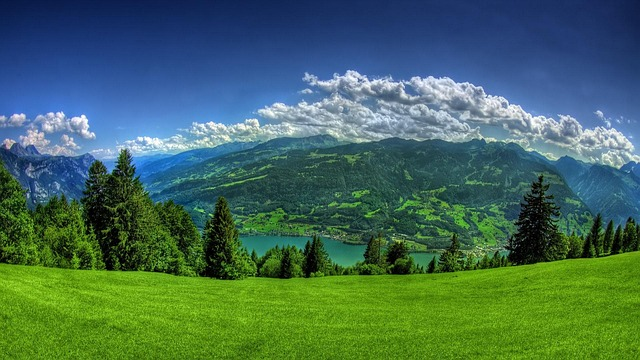
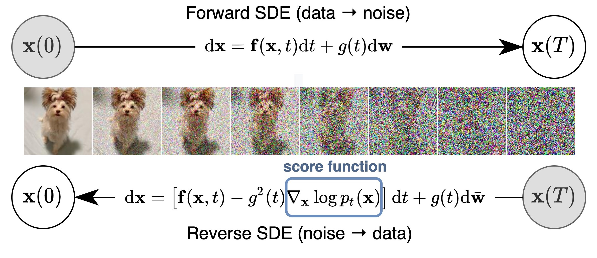
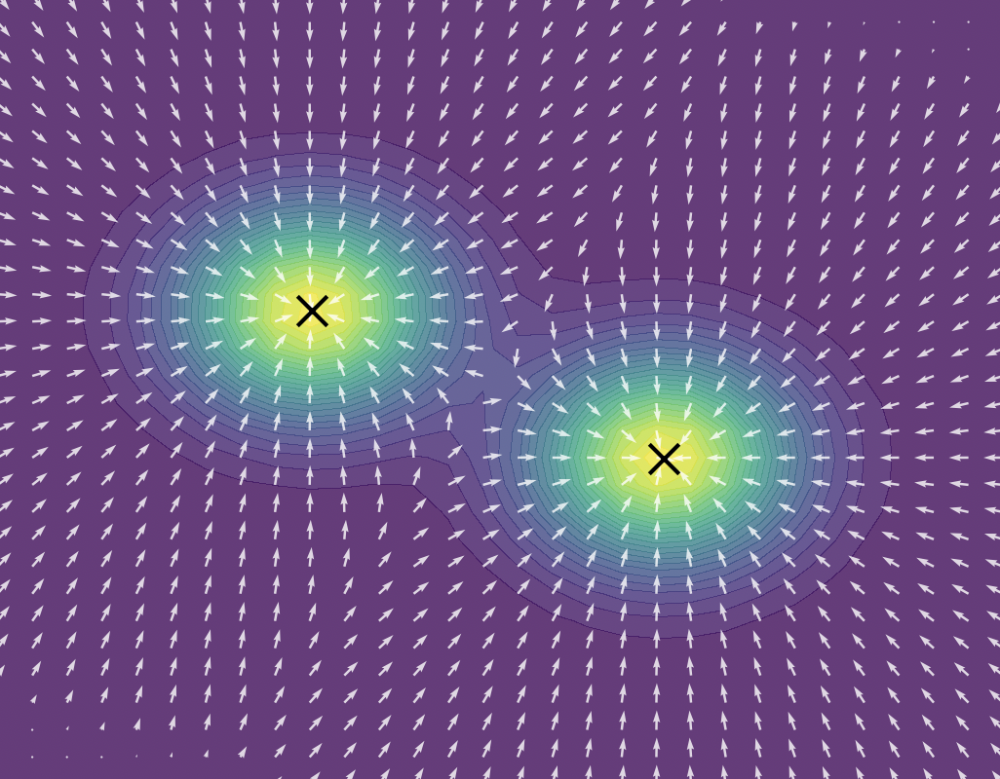
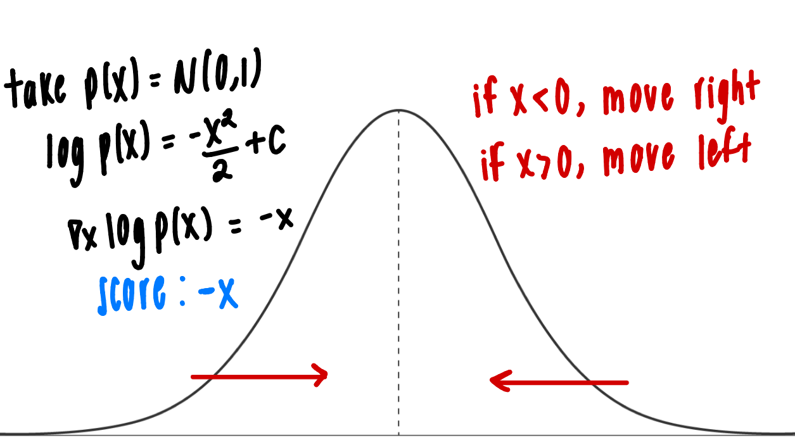
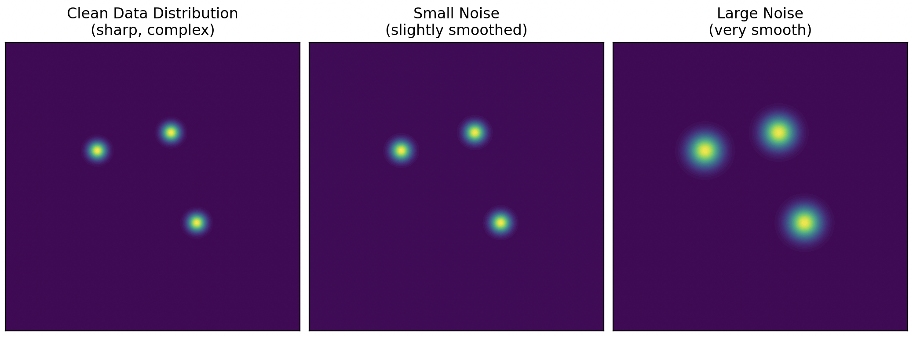
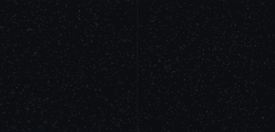

Recently I've been super interested in diffusion and generative models. This repo documents my understanding and time spent on how image generation methods work. Something that really helped me grasp the high dimensional math that is often abstracted is to think of an image as a point in high dimensional space: `(R,G,B) * width (pixels) * height (pixels)`. Random noise is one type of point in this space, and a real image is another type of point. The goal of any image generation model is to learn how to move from the noise region of this space toward the real image region.

A helpful first intuition is Gaussian blur. The Guassian blur is really just understood as the average of the pixels around it. Radius defined as the `nxn` matrix that you take around it. Bigger the blur radius, the more blur the picture is. Original, n = 5, n = 10.

  
  

Define forward process as moving from true image to noise, and reverse as moving from noise to true image; forward is easier :). Diffusion models learn a reverse process starting from noise to true image as a sequence of transformations. Why can't we do it one step?

All at once from pure noise is impossible to stabilize in one pass, and far too slow and computationally expensive. When the number of noise scales approaches infinity, we essentially perturb the distribution of data with continuously growing levels of noise. Then, the noise perturbation procedure is a **continuous-time stochastic process**. 

Really any generative image process is a stochastic process (super high-level explanation): drift term + diffusion term. The drift term is what pushes generation towards noise during the forward process and towards structure in the reverse process. The diffusion term is some fuction $g(t)$ for random noise with tiny Gaussian noise steps. This is better explained in Equation 6 & 7 in the paper: https://arxiv.org/pdf/2006.11239.

Solving a reverse SDE yields a score based generative model. Transforming data to a noise distribution can be done with an SDE. It can be reversed to generate samples from noise if we know the score of the distribution at each time step.

Score based generative models (SGMs) are a new paradigm in generation but foundational to diffusion. The score function $ \nabla_{x} \log {p_t}(x) $ is a vector field pointing toward the highest density regions, where data is more likely to exist at a given noise level.

Each arrow points in the direction where the probability density increases fastest. At high noise levels, a sample might begin in a low density region, but by repeatedly learning the score field, the reverse process moves it toward higher density regions where realistic images are more likely to exist (green in image).

Quick 1D example (trivial but helpful admist so much abstract math):

Now think back to what I said above, think of images as points in high-dimensional space (trust me, it makes this stuff so much easier). True images lie on a tiny structured subset of the full space, and much of the space is utter garbage. But training on just the clean image distribution is not feasible as the density is sharp and concentrated.

So we add Gaussian noise to the image, we create a new noisy distribution.

Instead of learning the clean distribution, we learn the noisy image distribution: $ s(x,t)\approx\nabla_{x} \log {p_t}(x) $. 

The work in this repository is slightly different. Rather than training a score network directly, I used flow matching. For info on score based diffusion: https://yang-song.net/blog/2021/score/.

Diffusion models learn to reverse noise and predict what to subtract. Flow matching is different: the model learns a velocity field, a direction and speed at every point in space that tells a sample where to move next.

Think of it like a wind map. Each point in the space carries an arrow. You drop a noise sample anywhere, follow the arrows, and you arrive at a data sample. Define two distributions: $x_0 \sim p_0 \text{ (noise — standard Gaussian)}$ and $x_1 \sim p_1 \text{ (data — the real distribution)}$.
 
Connect them with a linear path parameterized by some time variable $t$: $x_t = (1 - t)\, x_0 + t\, x_1$. The velocity along this path is constant: $\frac{d x_t}{dt} = x_1 - x_0$
 
For each training step, we sample a pair and a random time, calculated the interpolated point, then supervise the model on the velocity:
 
$$x_t \mid x_0, x_1 = (1 - t)\, x_0 + t\, x_1$$
 
$$u_t(x_t \mid x_0, x_1) = x_1 - x_0$$
 

Start from a noise sample $x_0 \sim p_0$, then integrate the learned ODE forward in time: $\frac{d x_t}{dt} = v(x_t, t)$.
 
The simplest solver is Euler with step size $h$ (what I used for simplicity): $x_{t+h} = x_t + h \cdot v(x_t, t)$. Because the training paths are straight lines, the learned field is nearly linear so far less solver steps are needed compared to diffusion. 

Small comparison show below where flow matching is on the left and diffusion on the right.

### Problem 1: Latent Space and VAEs

The first improvement is to stop doing all of this directly in pixel space. Remember to think of an image as a point in high dimensional space, but for larger images this becomes extremely expensive. For example, a `256 x 256` RGB image lives in a space with `256 * 256 * 3 = 196,608` dimensions. Learning a flow field directly over that space is possible, but it is inefficient because most pixel level changes is not semantically meaningful.

A Variational Autoencoder (VAE) solves this by learning a compressed latent representation of the image. Instead of asking the flow model to move through raw pixel space, we first train an encoder-decoder model:

$$
\text{image } x \rightarrow \text{encoder} \rightarrow z \rightarrow \text{decoder} \rightarrow \hat{x}
$$

The encoder maps the image into a much smaller latent tensor $z$, and the decoder maps that latent tensor back into an image. The important part is that the latent space is lower dimensional than pixel space, so generative modeling becomes easier.

A normal autoencoder would map each image to a fixed latent vector. A VAE instead maps each image to a distribution. So the encoder predicts two things: a mean and a variance, and we sample the latent. This makes the latent space continuous and sampleable, instead of becoming an arbitrary lookup table of compressed images.

The VAE objective has two terms. The first term is reconstruction loss, which makes the decoded image look like the input image: $\mathcal{L}_{\text{recon}} = \|x - \hat{x}\|^2$.

The second term is a KL penalty, which keeps the the encoder’s output (latent distribution) close to a standard Gaussian: $\mathcal{L}_{\text{KL}} = D_{KL}\left(q_\phi(z \mid x) \;\|\; \mathcal{N}(0, I)\right)$.

So the full objective is $\mathcal{L}_{\text{VAE}} = \mathcal{L}_{\text{recon}} + \beta \mathcal{L}_{\text{KL}}$.

The $\beta$ term controls how strongly we force the latent space to look Gaussian. If $\beta$ is too high, reconstructions becomes blurry because the model is forced to compress too aggressively. If $\beta$ is too low, the latent space will reconstruct well but become harder to sample from.

This is useful for flow matching because the flow model can now run in latent space instead of pixel space. The new pipeline becomes $x$ to VAE encoder to $z_1$.

Then flow matching is applied to $z_1$ instead of $x_1$:

$$
z_0 \sim \mathcal{N}(0, I)
$$

$$
z_t = (1 - t)z_0 + t z_1
$$

$$
u_t(z_t \mid z_0, z_1) = z_1 - z_0
$$

The flow model learns $v(z_t, t) \approx z_1 - z_0$. At inference time, we start from random latent noise and integrate the learned ODE: $\frac{dz_t}{dt} = v(z_t, t)$.

Finally, the VAE decoder turns the generated latent $z_1$ back into an image $\hat{x}$. This is the same high-level idea used in latent diffusion models: so do the expensive generative modeling in a compressed latent space, then decode the final result back into pixels.

### Problem 2: Classifier Free Guidance

The fundamental problem with diffusion (unconditional generation) is that diffusion goes from noise to image step by step. This means it is highly unsuitable to generate a desired output because the generation cannot be controlled. So the question becomes: can you perturb the denoising trajectory?

Answer is classifier guidance generation. First, this means to train a noisy image classifier to generate a class label. Classifier output is $\nabla_{x_t} \log p(y \mid x_t)$. That is a noise component that is more aligned for a specific class. The main purpose is to improve quality of conditional diffusion models without needing a separate, pre-trained classifier.

What this yields is $\gamma \, \nabla_{x_t} \log p(y \mid x_t)$ where $\gamma > 1$ to amplify the signal. This shifts probability mass from the least likely to the most likely class values, meaning the greater the $\gamma$, the more class consistent the generation. $\gamma$ is the inverse temperature parameter. For non-technical people, low $\gamma$ would mean exploring new options and high $\gamma$ would mean exploitation of the best option.

So the old $\epsilon_\theta(x_t, t)$ now is $\hat{\epsilon}(x_t, t, y) = \epsilon_\theta(x_t, t) - \gamma \, \nabla_{x_t} \log p(y \mid x_t)$; this an overtly high-level explanation of how this approximation is made. More info: https://arxiv.org/pdf/2207.12598.

We basically sample gradients from a classifier when classifying an image of a desired class and feed that gradient to the diffusion model to ultimately perturb the model.

How to get class guidance without an independent classifier? Use the diffusion model itself to get perturbations.

Instead of training a separate classifier, we train a single diffusion model that can operate both conditionally and unconditionally. This is done using conditioning dropout, where the conditioning variable (the thing you want the model to generate according to): $y$ is randomly removed during training. When $y$ is removed, the model learns to behave like an unconditional model.

At inference time, we can calculate both $\epsilon_\theta(x_t, t, y)$ and $\epsilon_\theta(x_t, t, \phi)$ using the same network. The difference between these implicitly captures the direction toward the class, replacing the need for $\nabla_{x_t} \log p(y \mid x_t)$.

This leads to classifier-free guidance:

$$\hat{\epsilon}(x_t, t, y) = \epsilon_\theta(x_t, t, \phi) + \gamma \left( \epsilon_\theta(x_t, t, y) - \epsilon_\theta(x_t, t, \phi) \right)$$

or in the paper:

$$\hat{\epsilon}(x_t, t, y) = (1 - \gamma)\,\epsilon_\theta(x_t, t, \phi) + \gamma\,\epsilon_\theta(x_t, t, y)$$

This achieves the same effect as classifier guidance, but without requiring a separate classifier.

### Remarks
Thanks for reading this! I really like seeing things end to end and doing so makes it far easier for me to visualize and understand how generative models like diffusion models work.

I'm also working on an autogressive MoE image generation model that I hope to showcase soon too!
