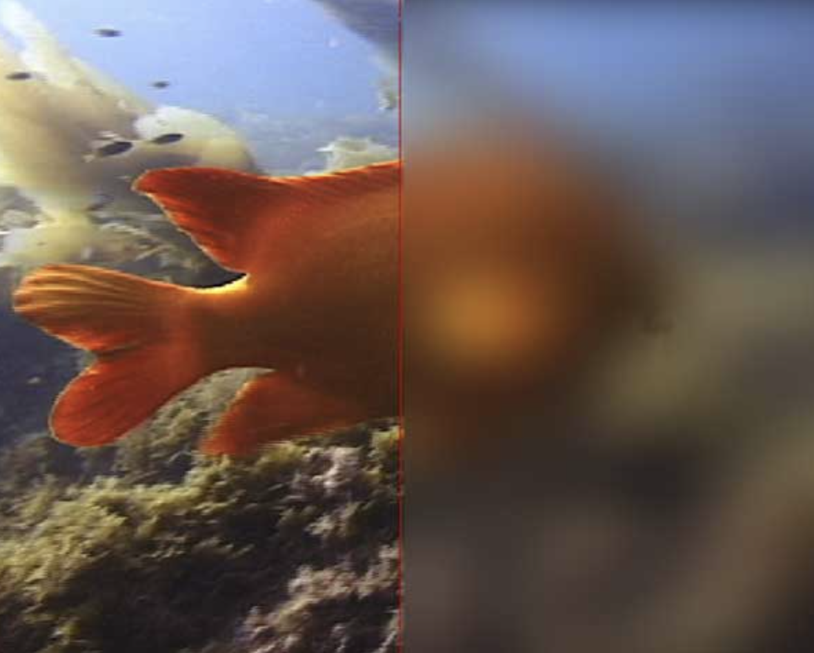

Inpainting is the process of reconstructing or editing specific areas of an image by filling in missing or changed parts. We can tweak the standard diffusion approach to use an approach from the RePaint paper: https://arxiv.org/pdf/2201.09865. 

Given an image, and a binary mask $m$, we can create a new image that has the same content where $m$ is 0, but new content wherever $m$ is 1. To do this, we can run the diffusion denoising loop. But at every step, after obtaining the new image, we force the new image to have the same pixels as the before image where $m$.

We leave everything inside the edit mask alone, but we replace everything outside the edit mask with our original image (LINE 8).